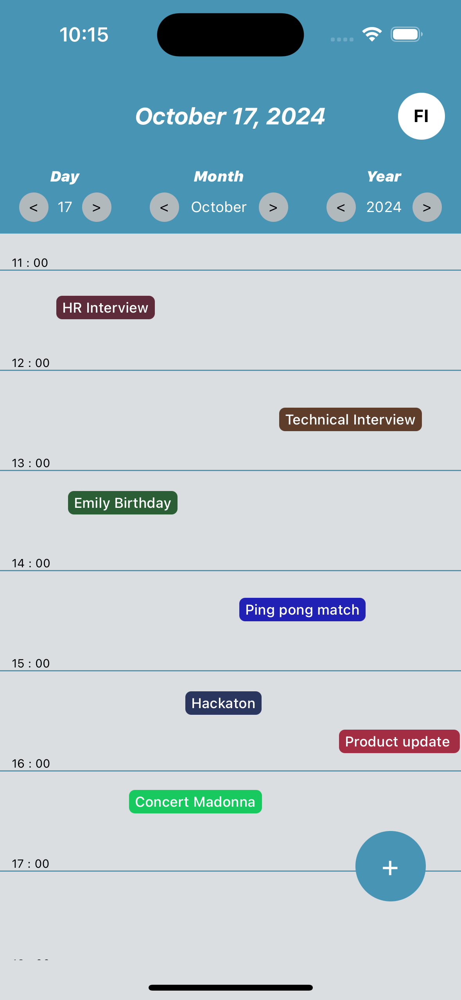
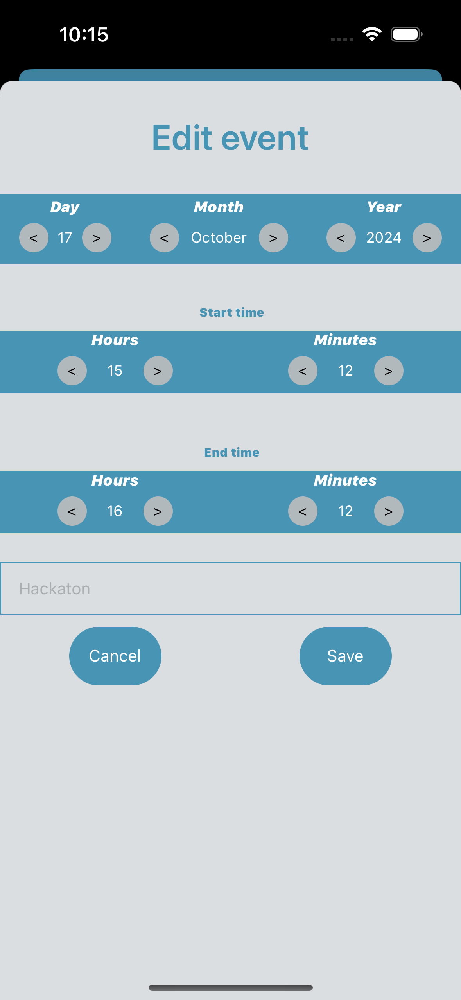
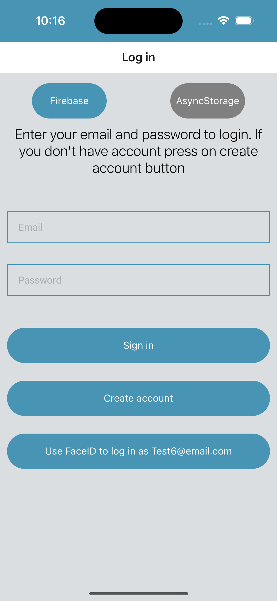
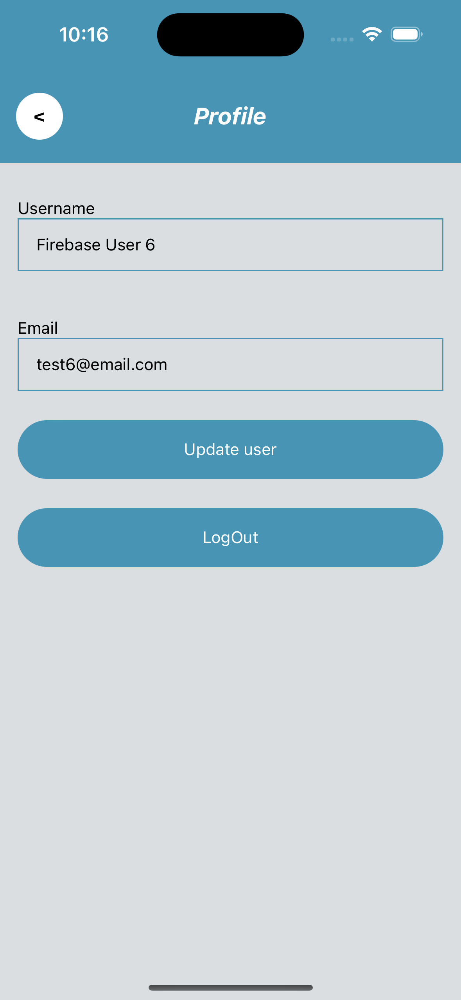

# Calendar Events App

>**Note**: Make sure you have completed the [React Native - Environment Setup](https://reactnative.dev/docs/environment-setup) instructions till "Creating a new application" step, before proceeding.

## INSTALATION

Make sure you follow "https://reactnative.dev/docs/environment-setup" for setuo react native environment (react-native": "0.75.4").
Open the terminal and navigate to root of the project 
run "npm start"
run "i" for ios, and "a" for android

```bash
# using npm
npm start
```
### For iOS

```bash
# using npm
npm run ios
```

### For Android

```bash
# using npm
npm run android
```

## TESTS

Open terminal and navigate to root of the project
run "npm test".

### Running tests

```bash
# using npm
npm test
```

## USAGE
This app handle two ways of storage "Firebase" and "AsyncStorage". You can choose which storage you want to use at initial screen.
If you want to change storage you need to log out user and get back to initial screen (Sign in screen)
After you create account you can use biometrics to log in with that account. Biometrics works with last authenticated user (Signed in or Signed up) depending on storage.
To make sure that biometrics will work you need to enable simulator to work with biometrics, if you don't enable it, button for biometrics will not be shown.
Be aware that simulator sometimes get stuck and biometrics can't be enroled from first time so please try few times. Enable biometrics:
    ios = Features tab -> FaceID -> check "Enroled".
    android = FaceID doesn't work on simulator, but touch id work. Setup touch ID in settings of simulator (like normal device) and simulate on 3 dots -> fingerprints -> Touch sensor

